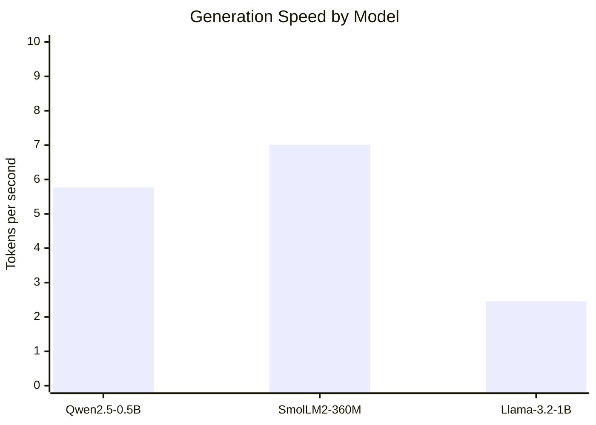
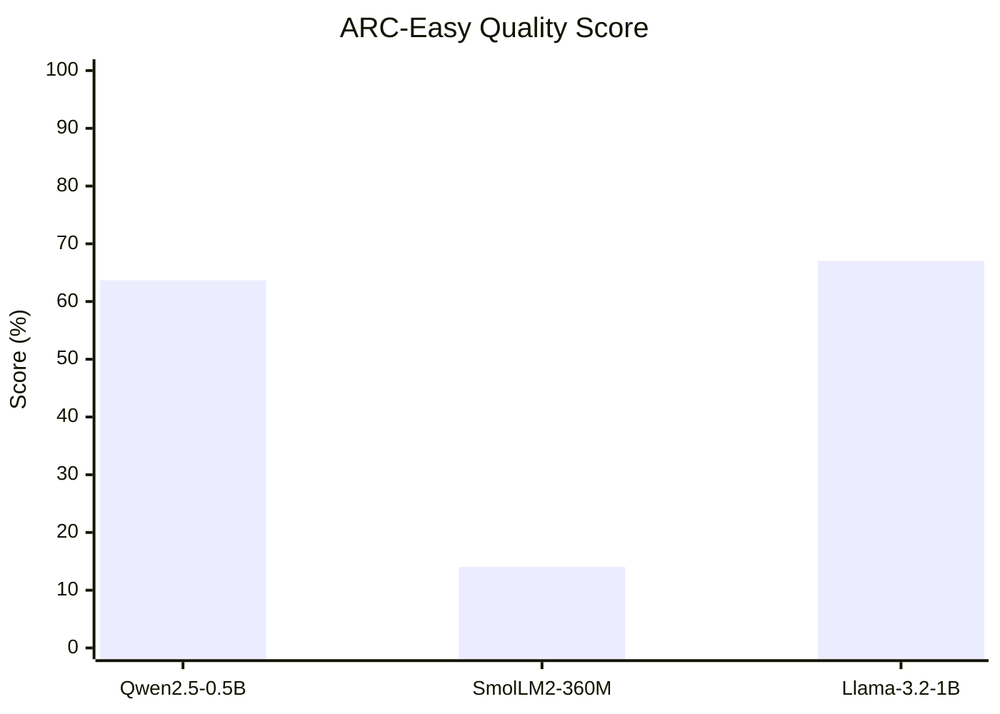
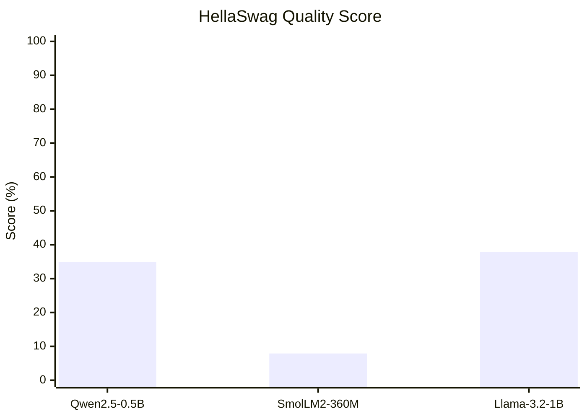
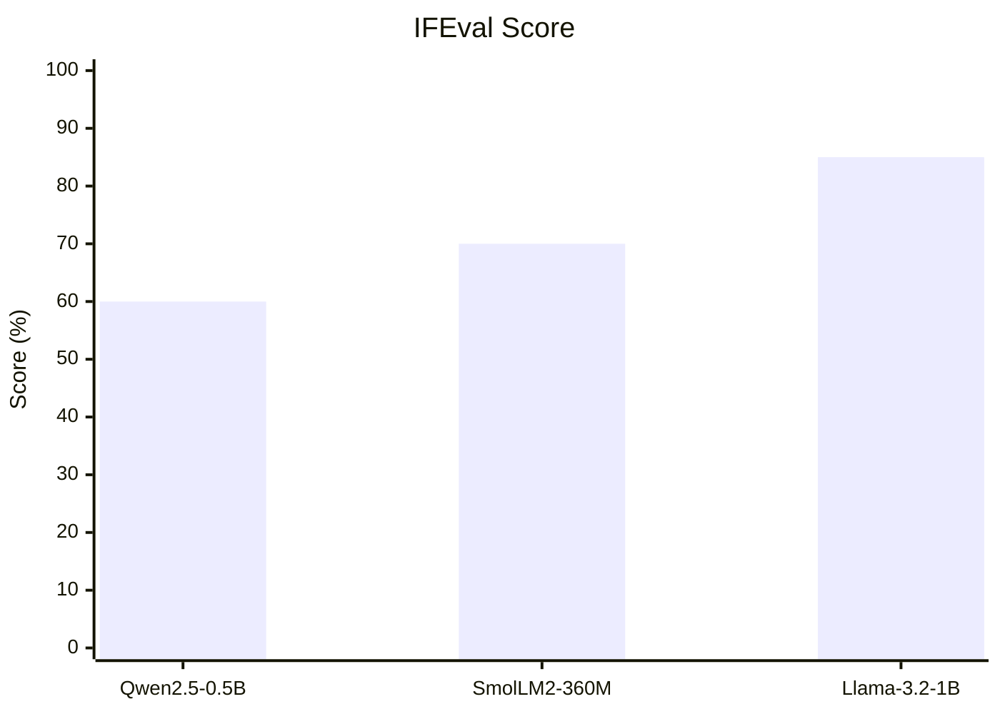
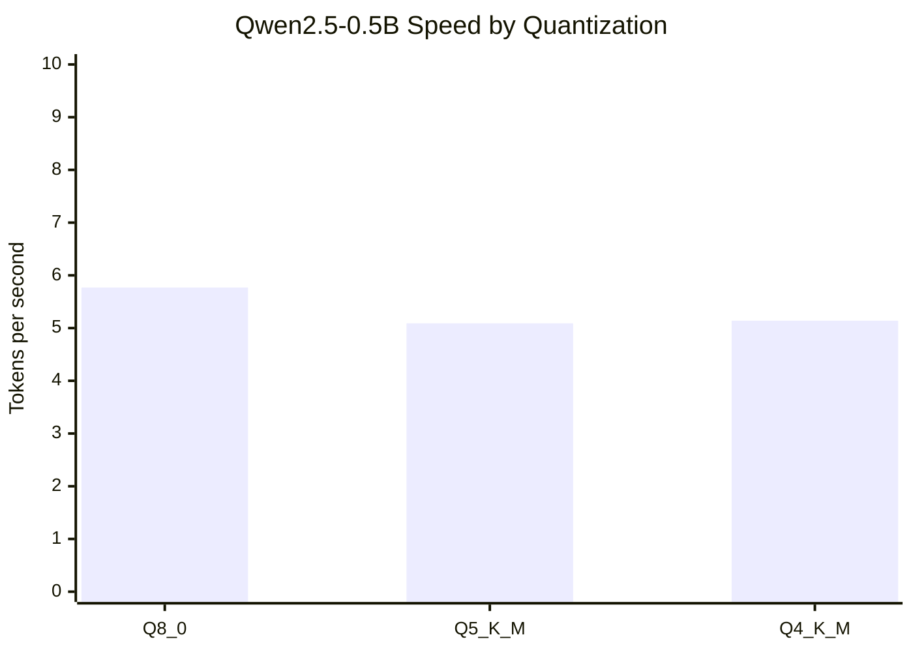
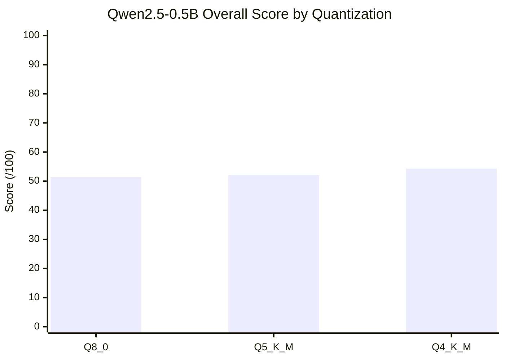
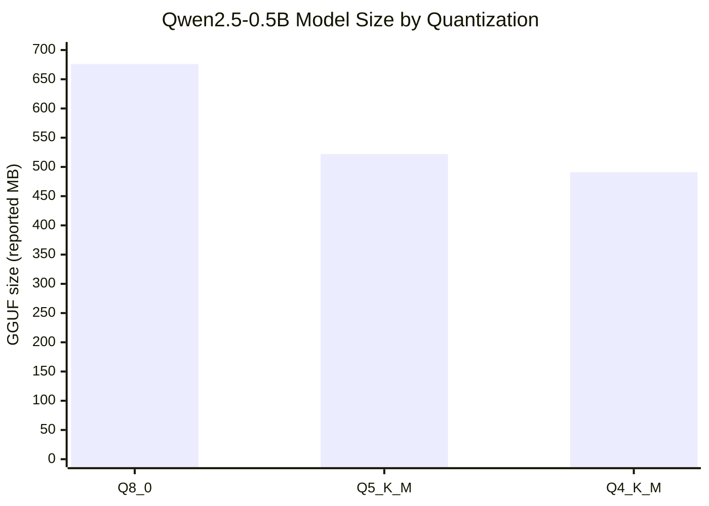
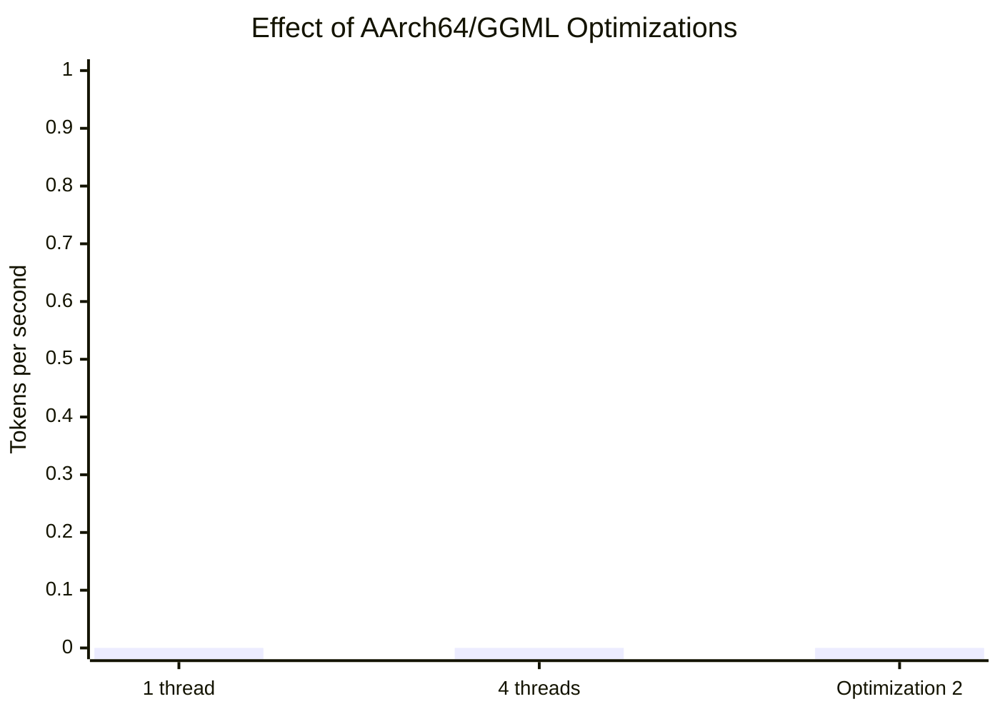
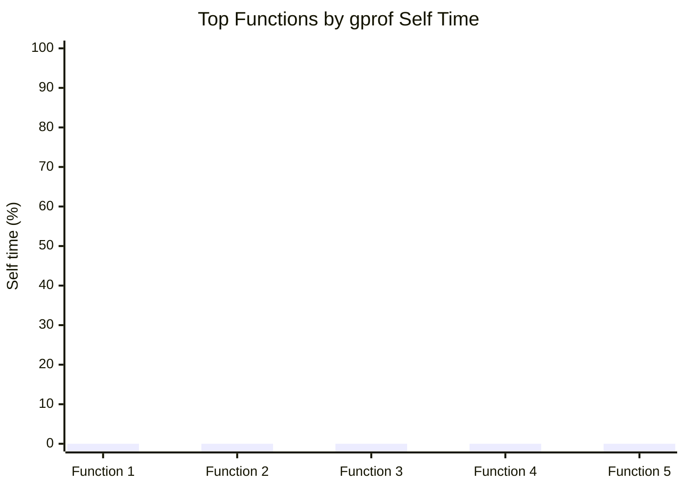

# ECE 382M.20 — Lab 1: Benchmarking and Profiling `llama.cpp` on Ultra96

**Team members:** Venthan Dinesh, Morris Lin, Alice Liu
**Date:** 09/20/2026 
**Board:** Ultra96, quad-core Arm Cortex-A53, 2 GB RAM  

## 1. Overview

This lab evaluates the accuracy and inference speed of compact large language models on an Ultra96 Arm platform. We benchmarked Qwen2.5-0.5B-Instruct and two additional models using tasks sampled from ARC-Easy, HellaSwag, and IFEval. We also compared three quantization formats and measured the effect of Arm/GGML optimizations. Finally, we profiled Qwen2.5-0.5B-Instruct at Q8_0 on one Cortex-A53 core at approximately 300 MHz to identify the main execution bottlenecks.

SmolLM2-360M-Instruct was the fastest model at 7.01 token/s, while Llama-3.2-1B-Instruct achieved the highest overall quality score, 58.9/100, at 2.46 token/s. The dominant profiling bottleneck was `[FILL after profiling]`.

## 2. Models and Evaluation

### 2.1 Models

| Model | Parameters | Architecture/family | Quantization | GGUF size | Reason selected |
|---|---:|---|---|---:|---|
| Qwen2.5-0.5B-Instruct | 0.49B | Qwen2 decoder-only Transformer | Q8_0 | 644.4 MiB | Required baseline |
| SmolLM2-360M-Instruct | 0.36B | SmolLM2 decoder-only Transformer | Q8_0 | 386 MB | Smaller model at the same quantization level |
| Llama-3.2-1B-Instruct | ~1.24B | Llama 3.2 decoder-only Transformer | Q4_K_M | 808 MB | Larger model using lower-bit quantization |

Model architecture information was obtained from the model cards and inspected with `[FILL: Netron or another tool]`. The selected models fit within the Ultra96's memory limit. Peak resident memory was measured with `/usr/bin/time -v` and checked against `free -h` during execution.

### 2.2 Benchmark tasks and correctness

The supplied benchmark invokes `llama-server` and samples three task families:

- **ARC-Easy** contains grade-school science multiple-choice questions. The script scores the probability assigned to every choice using a rectified multiclass Brier skill score.
- **HellaSwag** asks the model to choose the most plausible continuation of a situation. It uses the same probability-based Brier skill score. A uniform distribution over the four choices receives zero skill, while a confident correct prediction approaches one.
- **IFEval** measures instruction following using automatically verifiable constraints such as a required number of sentences, mandatory keywords, or a required output format. Its item score is the fraction of constraints satisfied.

Every item is graded from zero to one. Negative Brier skill values for confidently wrong ranking answers are rectified to zero. The 50 item scores are summed and rescaled to 100, so the reported result is a graded quality score rather than ordinary binary accuracy. This explains fractional item values such as 0.635. The report uses the term “score” for these benchmark outputs.

The current Qwen result is from one run with four server threads. Speed is the benchmark's decode throughput in generated tokens per second. The remaining models will be measured with the same thread count and benchmark settings.

## 3. Model Benchmark Results

### 3.1 Speed and benchmark scores

| Model | Speed (token/s) | ARC-Easy score (%) | HellaSwag score (%) | IFEval score (%) | Overall score (/100) | Peak RSS (MiB) |
|---|---:|---:|---:|---:|---:|---:|
| Qwen2.5-0.5B-Instruct Q8_0 | 5.77 | 63.69 | 34.89 | 60.00 | 51.4 | `[FILL]` |
| SmolLM2-360M-Instruct Q8_0 | 7.01 | 14.05 | 7.90 | 70.00 | 22.8 | `[FILL]` |
| Llama-3.2-1B-Instruct Q4_K_M | 2.46 | 67.02 | 37.82 | 85.00 | 58.9 | `[FILL]` |

The per-section values above were reconstructed from item scores printed to three decimal places and may differ from the benchmark's full-precision `--report` values by a few hundredths of a percentage point. The overall scores and throughput values are the benchmark's directly reported results.

Figure 1 compares decode throughput for the three models.



Figures 2–4 compare the three task-section scores on a common 0–100% scale.







### 3.2 Discussion

Qwen2.5-0.5B-Instruct achieved 5.77 token/s, with scores of 63.69%, 34.89%, and 60.00% on ARC-Easy, HellaSwag, and IFEval, respectively. Its overall score across all 50 items was 51.4/100. SmolLM2-360M-Instruct reached 7.01 token/s, making it 21.5% faster than Qwen, but its overall score was only 22.8/100. Llama-3.2-1B-Instruct achieved the highest overall score, 58.9/100, including the highest score in every task category. Its throughput was 2.46 token/s, 57.4% below Qwen and 64.9% below SmolLM2.

The results show a trade-off between model capability and resource cost. SmolLM2 has fewer parameters and a 386 MB Q8_0 file, compared with Qwen's 644.4 MiB Q8_0 file, which is consistent with its higher throughput. Its much lower ARC-Easy and HellaSwag scores show that the speed improvement came with a substantial capability cost. Llama-3.2 has the largest parameter count and an 808 MB Q4_K_M file. Despite using lower-bit weights, it was the slowest model because its larger network requires more computation. In return, it exceeded Qwen by 7.5 points overall, including gains of 3.33, 2.93, and 25.00 percentage points on ARC-Easy, HellaSwag, and IFEval. Because this benchmark uses only 50 items, including just 10 IFEval prompts, these measurements should be interpreted as results for this lab workload rather than broad estimates of model quality.

## 4. Quantization in `llama.cpp` and GGML

### 4.1 Representation and execution

GGUF stores each tensor together with its shape and GGML data type. A model described as “mostly Q8_0” does not necessarily encode every tensor as Q8_0: tensor-selection logic may preserve one-dimensional or accuracy-sensitive tensors at higher precision. When the model is loaded, `llama.cpp` constructs a GGML computation graph whose nodes represent operations such as normalization, matrix multiplication, attention, and element-wise functions. The backend selects kernels according to the operation, tensor types, and detected CPU features.

GGML uses block quantization. For Q8_0, each block contains 32 signed 8-bit values and one FP16 scale. Conceptually, an original weight is approximated by

\[
w_i \approx d q_i,
\]

where \(d\) is the block scale and \(q_i\) is the signed integer code. A Q8_0 block occupies 34 bytes for 32 weights: 32 bytes of integer values plus a 2-byte scale. Its effective storage is therefore 8.5 bits per weight, before container metadata.

The model is not fully expanded to floating point before inference. Optimized matrix-multiplication kernels consume quantized blocks, convert or combine blocks as needed, and accumulate dot products at higher precision. Activations may be converted to an intermediate quantized layout selected by the kernel, while normalization, nonlinear operations, logits, and other intermediate tensors use supported floating-point types as required. Weight precision, KV-cache precision, activation/intermediate precision, and accumulator precision are separate choices. The actual types printed by the tested build should therefore be recorded rather than assuming that a Q8_0 filename means every computation uses 8-bit arithmetic.

K-quant formats group weights into larger superblocks and encode per-block scales/minima compactly. Formats such as Q4_K and Q5_K reduce memory traffic more aggressively than Q8_0, at the cost of greater rounding error and more complicated unpacking. Reduced memory traffic can improve speed on a bandwidth-limited CPU, but lower bit width is not guaranteed to be faster if its unpacking kernel is less efficient on the target processor.

Quantization introduces error when floating-point weights are mapped to a limited set of integer codes. Q8_0 normally preserves model behavior better than lower-bit formats because it has more representable levels. Q4/Q5 formats use less storage and memory bandwidth but may reduce ARC, HellaSwag, or IFEval scores. The measured results in the next section quantify this trade-off for the target board.

### 4.2 Quantization results for Qwen2.5-0.5B-Instruct

| Quantization | Effective/nominal precision | GGUF size (reported MB) | Peak RSS (MiB) | Speed (token/s) | ARC-Easy (%) | HellaSwag (%) | IFEval (%) |
|---|---:|---:|---:|---:|---:|---:|---:|
| Q8_0 | 8-bit blocks (8.5 bpw including scale) | 676 | `[FILL]` | 5.77 | 63.69 | 34.89 | 60.00 |
| Q5_K_M | Mixed K-quant, approximately 5-bit weights | 522 | 1004.3 | 5.09 | 62.23 | 32.96 | 70.00 |
| Q4_K_M | Mixed K-quant, approximately 4-bit weights | 491 | 977.6 | 5.14 | 60.97 | 32.35 | 85.00 |

The Q5_K_M and Q4_K_M files were approximately 22.8% and 27.4% smaller than Q8_0. Q4_K_M used 26.7 MiB (2.7%) less peak resident memory than Q5_K_M. The runtime-memory reduction is smaller than the storage reduction because peak RSS also includes the server, KV cache, computation buffers, and other allocations that are not reduced with weight quantization.

The following charts compare speed, overall benchmark score, and model-file size for the three tested quantizations.







Q5_K_M and Q4_K_M generated 5.09 and 5.14 token/s, respectively, compared with 5.77 token/s for Q8_0. They were therefore 11.8% and 10.9% slower than Q8_0 in these runs. Q4_K_M was slightly faster than Q5_K_M and used 26.7 MiB less peak resident memory. This non-monotonic result shows that reduced weight size does not guarantee proportionally faster execution: kernel efficiency and unpacking costs also matter on Cortex-A53.

Q5_K_M scored 62.23%, 32.96%, and 70.00% on ARC-Easy, HellaSwag, and IFEval, producing an overall score of 52.1/100. Q4_K_M scored 60.97%, 32.35%, and 85.00%, producing 54.3/100. Relative to Q8_0, both lower-bit formats scored slightly lower on ARC-Easy and HellaSwag but higher on IFEval. The higher aggregate scores do not establish that lower-bit quantization improves accuracy: only ten IFEval prompts were used, every format was run once, and the IFEval differences dominated the aggregate. Repeated runs or a larger task sample would be needed to separate quantization effects from sample variability.

## 5. GGML Hardware Optimizations on AArch64

The Cortex-A53 implements 128-bit Arm NEON SIMD. GGML contains architecture-specific CPU kernels that use NEON vector operations to process several quantized values per instruction. This is especially important for matrix-vector products, which dominate autoregressive token generation. The tested Cortex-A53 implements the Armv8-A baseline and does not provide newer Armv8.2/Armv8.6 features such as dot-product or I8MM instructions; a binary must not be compiled with unsupported instruction-set extensions.

GGML also distributes tensor operations across worker threads. Increasing `-t` can use multiple Cortex-A53 cores during token generation, while `-tb` controls the batch/prompt-processing thread count. Scaling may be limited by memory bandwidth, synchronization, small matrix sizes, and thermal or frequency constraints. Quantization itself is another hardware-relevant optimization because smaller weight tensors reduce memory traffic and improve cache residency.

We evaluated the following configurations using Qwen2.5-0.5B Q8_0 and the same prompt/workload:

| Configuration | Active cores | `-t` | `-tb` | Build flags/features | Speed (token/s) | Relative speedup |
|---|---:|---:|---:|---|---:|---:|
| Baseline | 1 | 1 | 1 | `[FILL]` | `[FILL]` | 1.00× |
| Multi-threaded | 4 | 4 | 4 | `[FILL]` | `[FILL]` | `[FILL]`× |
| `[FILL: second optimization, e.g. tuned Cortex-A53/NEON build]` | `[FILL]` | `[FILL]` | `[FILL]` | `[FILL]` | `[FILL]` | `[FILL]`× |



Moving from one to four threads changed throughput from `[FILL]` to `[FILL]` token/s, a speedup of `[FILL]`× and a parallel efficiency of `[FILL]%`. `[FILL: Explain why the speedup is or is not close to 4×.]` The second optimization changed throughput by `[FILL]%`. `[FILL: Connect the result to NEON use, compiler code generation, memory bandwidth, cache behavior, or kernel support.]`

## 6. Profiling Qwen2.5-0.5B Q8_0

### 6.1 Method

Profiling used the lab's required target configuration: one active Cortex-A53 core at approximately 300 MHz. Qwen2.5-0.5B-Instruct Q8_0 ran single-threaded with the prompt “Describe a system-on-chip in two sentences.” The executable was instrumented with `-pg`, and the resulting `gmon.out` was analyzed with `gprof`.

The flat profile's **self time** estimates time spent inside a function itself, while **cumulative time** also reflects the calling sequence. Because `gprof` is sampling/instrumentation based, very short functions, inlined functions, and time attributed through optimized kernels may not be represented perfectly.

### 6.2 Profiling results

Copy the leading rows from the `gprof` flat profile. Preserve the exact symbol names.

| Rank | Function | Self time (%) | Cumulative time (%) | Calls | Interpretation |
|---:|---|---:|---:|---:|---|
| 1 | `[FILL]` | `[FILL]` | `[FILL]` | `[FILL]` | `[FILL]` |
| 2 | `[FILL]` | `[FILL]` | `[FILL]` | `[FILL]` | `[FILL]` |
| 3 | `[FILL]` | `[FILL]` | `[FILL]` | `[FILL]` | `[FILL]` |
| 4 | `[FILL]` | `[FILL]` | `[FILL]` | `[FILL]` | `[FILL]` |
| 5 | `[FILL]` | `[FILL]` | `[FILL]` | `[FILL]` | `[FILL]` |

Replace the labels and values below with the five highest self-time functions.



The dominant bottleneck was `[FILL: function/kernel]`, accounting for `[FILL]%` of self time. This function performs `[FILL: matrix-vector multiplication, dequantization/dot products, attention, sampling, etc.]`. The next largest costs were `[FILL]`. Together, the top `[FILL]` functions accounted for `[FILL]%` of sampled self time.

These results indicate that performance is primarily limited by `[FILL: computation, memory movement, quantized dot products, or another evidenced cause]`. A suitable optimization would be `[FILL]` because `[FILL: tie the proposal directly to measured functions]`. A second opportunity is `[FILL]`. The profile does not by itself prove `[FILL: e.g. memory-bandwidth saturation]`; confirming that claim would require hardware performance counters or controlled scaling measurements.

## 7. Conclusions

On the Ultra96, SmolLM2-360M-Instruct was the fastest tested model at 7.01 token/s but had the lowest overall score, 22.8/100. Llama-3.2-1B-Instruct achieved the highest quality score, 58.9/100, but generated only 2.46 token/s. Qwen2.5-0.5B-Instruct occupied the middle ground at 5.77 token/s and 51.4/100. For Qwen, Q5_K_M and Q4_K_M reduced decode throughput by 11.8% and 10.9% relative to Q8_0 in the single runs. Q4_K_M used 2.7% less peak RAM than Q5_K_M. The small, non-monotonic score differences do not support a claim that lower precision improved model quality.

The AArch64 experiments showed that `[FILL: optimization result]`. Under the required single-core, 300 MHz profiling configuration, `[FILL: function(s)]` dominated execution. The most promising next steps are therefore `[FILL: one or two optimizations supported by the profiling evidence]`.

## References

1. ECE 382M.20, [Lab 1 instructions](https://users.ece.utexas.edu/~gerstl/ece382m_f26/labs/lab1.htm).
2. `llama.cpp`, [official repository](https://github.com/ggml-org/llama.cpp).
3. `llama.cpp` wiki, [Tensor Encoding Schemes](https://github.com/ggml-org/llama.cpp/wiki/Tensor-Encoding-Schemes).
4. `llama.cpp`, [Q8_0 conversion implementation](https://github.com/ggml-org/llama.cpp/blob/master/examples/convert_legacy_llama.py).
5. `llama.cpp`, [Arm CPU backend build configuration](https://github.com/ggml-org/llama.cpp/blob/master/ggml/src/ggml-cpu/CMakeLists.txt).
6. P. Clark et al., [Think you have Solved Question Answering? Try ARC, the AI2 Reasoning Challenge](https://arxiv.org/abs/1803.05457), 2018.
7. R. Zellers et al., [HellaSwag: Can a Machine Really Finish Your Sentence?](https://arxiv.org/abs/1905.07830), 2019.
8. J. Zhou et al., [Instruction-Following Evaluation for Large Language Models](https://arxiv.org/abs/2311.07911), 2023.
9. Qwen, [Qwen2.5-0.5B-Instruct GGUF files](https://huggingface.co/Qwen/Qwen2.5-0.5B-Instruct-GGUF/tree/main).

## Appendix A. Raw Results

Paste the unedited benchmark summary for each run here so the tables can be audited.

### A.1 Qwen2.5-0.5B-Instruct Q8_0

```text
Model: Qwen2.5-0.5B-Instruct Q8_0
Threads: 4
HellaSwag item-score sum: 6.978 / 20 = 34.89%
ARC-Easy item-score sum: 12.737 / 20 = 63.69%
IFEval item-score sum: 6.000 / 10 = 60.00%
Total: 25.715 / 50 = 51.4 / 100
Decode throughput: 5.77 token/s
```

### A.2 Additional models

```text
Model: SmolLM2-360M-Instruct Q8_0
Threads: 4
HellaSwag item-score sum: 1.580 / 20 = 7.90%
ARC-Easy item-score sum: 2.810 / 20 = 14.05%
IFEval item-score sum: 7.000 / 10 = 70.00%
Total: 11.390 / 50 = 22.8 / 100
Decode throughput: 7.01 token/s

Model: Llama-3.2-1B-Instruct Q4_K_M
Threads: 4
HellaSwag item-score sum: 7.563 / 20 = 37.82%
ARC-Easy item-score sum: 13.403 / 20 = 67.02%
IFEval item-score sum: 8.500 / 10 = 85.00%
Total: 29.466 / 50 = 58.9 / 100
Decode throughput: 2.46 token/s
```

### A.3 Additional quantizations

```text
Model: Qwen2.5-0.5B-Instruct Q4_K_M
Threads: 4
HellaSwag: 6.469 / 20 = 32.35% (argmax accuracy 50.0%)
ARC-Easy: 12.194 / 20 = 60.97% (argmax accuracy 65.0%)
IFEval: 8.500 / 10 = 85.00% (strict accuracy 70.0%)
Total: 27.163 / 50 = 54.3 / 100
Load time: 28.4 s
Peak RSS: 977.6 MB
Prefill throughput: 7.78 token/s
Decode throughput: 5.14 token/s
TTFT median / p95: 3974.4 / 4679.5 ms
Wall clock: 634.74 s

Model: Qwen2.5-0.5B-Instruct Q5_K_M
Threads: 4
HellaSwag: 6.593 / 20 = 32.96% (argmax accuracy 45.0%)
ARC-Easy: 12.445 / 20 = 62.23% (argmax accuracy 75.0%)
IFEval: 7.000 / 10 = 70.00% (strict accuracy 50.0%)
Total: 26.038 / 50 = 52.1 / 100
Load time: 31.98 s
Peak RSS: 1004.3 MB
Prefill throughput: 7.55 token/s
Decode throughput: 5.09 token/s
TTFT median / p95: 4096.4 / 4830.1 ms
Wall clock: 647.44 s
```

### A.4 `gprof` excerpt

```text
[FILL]
```
